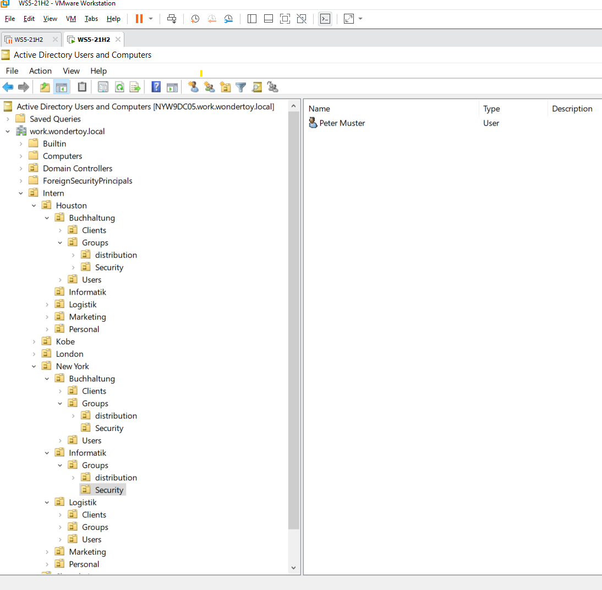

1. Ziel der Aufgabe

In dieser Übung habe ich in der Domäne work.wondertoys.local eine Organisationsstruktur erstellt.
Dazu musste ich:

OUs per PowerShell anlegen (CreateOUs.ps1)

Einen Benutzer in einer bestimmten OU erstellen (New-ADUser)

Ziel war es, eine logische Firmenstruktur nachzubauen, sodass Standorte eigene IT-Bereiche verwalten können.

2. Planung & OU-Struktur

Bevor ich mit dem Skript begonnen habe, habe ich die OU-Struktur analysiert und danach umgesetzt.

Foto schlussendliche AD Struktur:

 

Die OU wurde erstellt, wie in der Aufgabe beschrieben.

4. PowerShell-Skript CreateOUs.ps1 ausführen

Ich habe das Skript im PowerShell-ISE erstellt und gespeichert.

 

Nach der Ausführung habe ich kontrolliert, ob die OUs im AD sichtbar sind.

War erfolgreich wie im ersten Screenshot von mir zu sehen ist.

5. Benutzerkonto erstellen

Dann habe ich einen Benutzer in folgender OU erstellt:

Intern → NewYork → Informatik → Groups → Security

Mein Powershell Befehl:

New-ADUser -Name "Peter Muster" `
 -GivenName "Peter" `
 -Surname "Muster" `
 -SamAccountName "pmuster" `
 -AccountPassword (ConvertTo-SecureString "Hier habe ich das Passwort eingetragen" -AsPlainText -Force) `
 -Enabled $true 
 -Path "OU=Security,OU=Groups,OU=Informatik,OU=NewYork,OU=Intern,DC=work,DC=wondertoys,DC=local" 

📎 Screenshot: 

6. Ergebnis

Ich habe erfolgreich:

Die OU-Struktur in work.wondertoys.local erstellt

Die Struktur automatisiert per PowerShell erstellt

Einen Benutzer in die korrekte OU angelegt

Damit ist die Aufgabe abgeschlossen.
